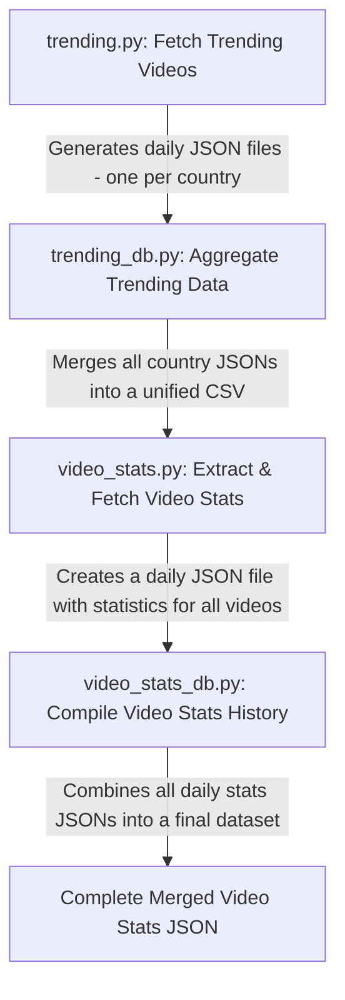

# 🚀 Tube Virality Project  

  
  

## 🎯 YouTube Trending Video Analytics API  

### **Project Purpose**  
The **Tube Virality** project aims to **collect, analyze, and model YouTube trending video data** across multiple countries using the **YouTube API**. This project goes beyond simply analyzing existing APIs; we are **building a custom API** to retrieve metadata—including view counts, likes, and descriptions—from YouTube videos and channels.

### **Key Objectives**  
- ✅ **Develop a custom API** to fetch YouTube video statistics.  
- ✅ **Collect trending videos** from various countries and store historical data.  
- ✅ **Analyze the collected data** to identify trends and patterns in virality.  
- ✅ **Build predictive models** to estimate a video's potential to go viral.

---

## 🛠️ How the Data is Collected  

The data is automatically collected using the **YouTube API** and stored in this GitHub repository:  
🔗 [Trending Video Metadata](https://github.com/gpsyrou/tube-virality/tree/main/assets/meta/trending)  

### **Collection Process**  
1. **Fetching Trending Videos**  
   - Using the YouTube API, trending videos from multiple countries are retrieved.  
   - The list of trending videos is stored and continuously updated.  

2. **Daily Statistics Updates** (Automated via **GitHub Actions**)  
   - A scheduled **GitHub Actions** workflow updates video statistics (views, likes, comments, etc.).  
   - These updates provide **historical trends** for analysis.  
   - The latest data is stored here:  
     🔗 [Video Statistics](https://github.com/gpsyrou/tube-virality/tree/main/assets/meta/video_stats)  

---

## 🔍 Understanding Video Virality  

### **What Defines a Viral Video?**  
A video's **virality** isn't simply measured by view count—it depends on engagement, growth rate, and audience reach. Here are key factors:  
📌 **Engagement Rate** – Likes, comments, and shares relative to views.  
📌 **Subscriber Growth** – New subscribers gained after the video is posted.  
📌 **Rapid View Growth** – Views gained in the first 24-48 hours.  

For instance:  
- A YouTuber with **1M subscribers** getting **20M views** is expected.  
- A YouTuber with **10K subscribers** getting **2M views** is **extraordinary**.  

Our models will classify videos as **"success" (viral)** or **"non-success"**, based on these metrics.

---

## 📊 Dataset & Features  

Our dataset includes key **video metadata** and **engagement statistics**, such as:  

- **Video Details**: Title, description, duration, resolution  
- **Engagement Metrics**: Views, likes, comments, favorite count  
- **Channel Details**: Subscriber count, total videos, upload frequency  
- **Trending History**: How long a video remains on the trending list  
- **Country-Based Analysis**: Virality trends across different regions  

📌 **Goal:** Use these features to identify patterns and train models for virality prediction.  

---

## 🔬 Methodology  

1️⃣ **Data Collection** – Retrieve daily trending videos across countries.  
2️⃣ **Data Cleaning & Preprocessing** – Handle missing values, outliers, and standardize data.  
3️⃣ **Exploratory Analysis** – Identify key trends and patterns.  
4️⃣ **Feature Engineering** – Extract additional insights like growth rate and engagement score.  
5️⃣ **Model Development** – Train ML models for virality prediction.  
6️⃣ **Evaluation & Interpretation** – Validate predictions and refine models.  

🚀 **Next Steps**  
🔹 Expand dataset with more countries and longer timeframes.  
🔹 Test **deep learning** approaches for virality prediction.  
🔹 Compare YouTube trends with TikTok & Instagram.  

---

## 💡 Technologies Utilized  

We've harnessed a blend of cutting-edge technologies to power the **Tube Virality** project:  

🔹 **Python 3.9** – Data processing, analysis, and ML model training.  
🔹 **SQL** – Storing structured video metadata for analysis.  
🔹 **Go** – Enhancing API performance and concurrent processing.  

---
