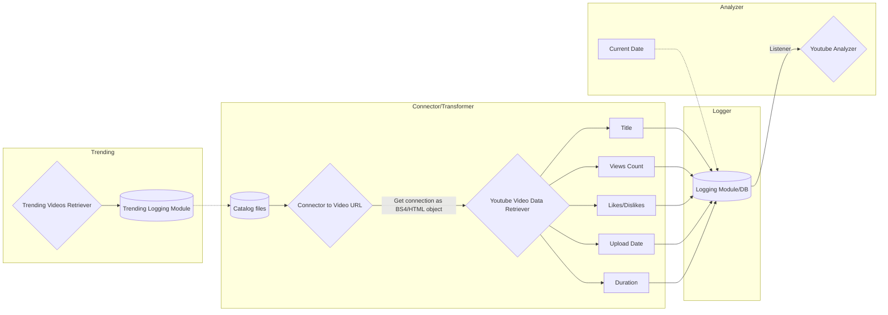

# tube-virality

# YouTube Trending Video Analytics API

The purpose of this project is to build an API to retrieve metadata such as the number of views, likes, and descriptions from YouTube videos and channels. We are building the retrieval API from scratch, rather than utilizing existing APIs from other developers that potentially exist and perform similar tasks. This approach gives us the ability to build all levels of abstraction we need for the API, from the smallest to the largest parts/modules.

Furthermore, we will utilize the API to collect data for a specific set of YouTube trending videos throughout time. Upon collecting a sufficient amount of data, we will move to the second part of the project which is going to be the actual analysis of the datasets collected to mine useful information and attempt to answer the following questions:

- What makes a YouTube video go viral?
- Can we build a model that understands when a new video has the potential to become viral?

## About

This project is focused on developing an API to retrieve statistics and information around YouTube trending videos. We will also perform descriptive statistics analysis and build models that are able to project the likelihood of a trending video to become viral. 

## Technologies Used

- Python 3.9
- SQL
- Go

## Installation

WIP

## Usage

WIP

## Contributors

- [Georgios Spyrou](https://github.com/gpsyrou)

## License

This project is licensed under the [MIT License](LICENSE).

### Proposed High-Level Architecture

### Entity-Relatioship Diagram

  

