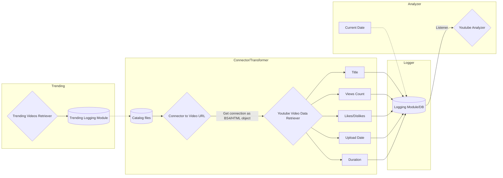

# Tube Virality Project

## YouTube Trending Video Analytics API

**Purpose:** The **Tube Virality** project aims to develop a comprehensive API that retrieves metadata, including view counts, likes, and descriptions, from YouTube videos and channels. Unlike relying on existing APIs, we're creating this retrieval API from the ground up. This approach grants us full control over all levels of abstraction, ensuring our API's efficiency and flexibility.

We will not only gather data but also utilize the API to collect information about a curated selection of trending YouTube videos over time. Once a substantial dataset is collected, we'll proceed to the next phase: analyzing the collected data to uncover insights and answer critical questions:

- What factors contribute to a YouTube video going viral?
- Can we construct a model capable of predicting when a new video has the potential to go viral?

## About the Project

The **Tube Virality** project is dedicated to constructing an API tailored to fetch statistics and details related to trending YouTube videos. Moreover, we're committed to conducting descriptive statistical analyses and crafting predictive models that gauge the likelihood of a trending video attaining viral status.

## Technologies Utilized

We've harnessed a blend of cutting-edge technologies to power the **Tube Virality** project:

- **Python 3.9:** This versatile programming language is at the core of our project, facilitating data manipulation, analysis, and model development.
- **SQL:** We're leveraging SQL databases to efficiently store and manage the collected data, ensuring scalability and structured data retrieval.
- **Go:** With the power of Go, we're enhancing our API's performance and concurrent processing capabilities, resulting in a robust and responsive user experience.

## Installation

WIP

## Usage

WIP

* temporary pull trending `make runPullTrending`
* temporary run `make run2video`

## Contributors

- [Georgios Spyrou](https://github.com/gpsyrou)

## License

This project is licensed under the [MIT License](LICENSE).

### Proposed High-Level Architecture

### Entity-Relatioship Diagram

  

