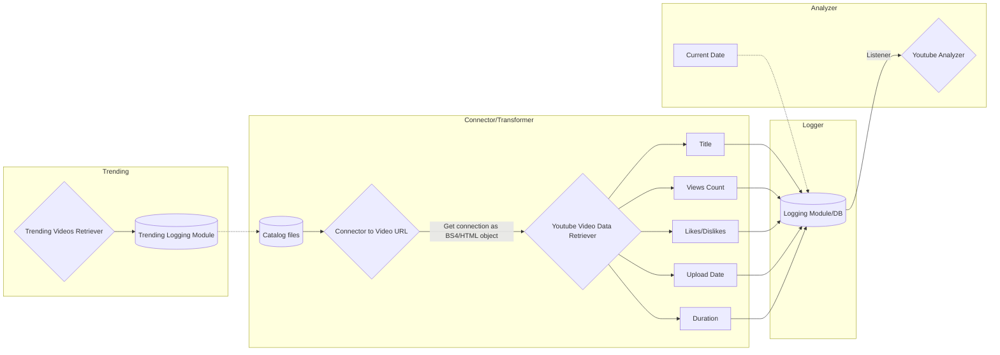

# tube-virality
### API  to connect and retrieve data from Youtube

### Description

Purpose of this project is to build an API to retrieve metadata (e.g. number of views, number of likes, description) from youtube videos and channels. We are focusing to build the retrieval API from scratch, rather than utilizing existing APIs from other developers that potentially exist and performing similar tasks. This will gives us the ability to build all level of abstractions that we want for the API, from the smallest to the largest parts/modules. While (and after) building the API, we will also utilize it to collect data for a specific set of Youtube videos throughout time. Upon collecting a sufficient amount of data, we will move to the second part of the project which is going to be the actual analysis of the datasets collected to mine useful information and attempt to answer the following questions: 

_What makes a Youtube video viral?_  
_Is there a way to build a model that understand when a new video has the potential to become viral ?_

### Proposed Architecture

### Entity-Relatioship Diagram

  

