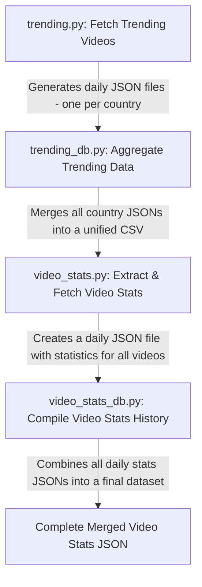

# 🚀 YouTube Trending Video Analytics and Virality Estimation 

## 🎯 YouTube Trending Video Analytics

### **Project Purpose**  
The **Tube Virality** project aims to **collect, analyze, and model YouTube trending video data** across multiple countries using the **YouTube API**. It aims to gather metrics like view counts, likes, and descriptions, then apply data science techniques to predict a video's likelihood of going viral.

### **Key Objectives**  
- ✅ **Collect Data via YouTube API**: Fetch trending videos and their statistics
- ✅ **Build Historical Database**: Track daily metrics for trending videos across countries
- ✅ **Identify Virality Patterns**: Analyze what characteristics correlate with viral success
- ✅ **Develop Predictive Models**: Create ML models to estimate virality potential
- ✅ **Provide Actionable Insights**: Help content creators understand virality factors

---

## 🛠️ How the Data is Collected  

The data is automatically collected using the **YouTube API** and stored in this GitHub location:  
🔗 [Trending Video Metadata](https://github.com/gpsyrou/tube-virality/tree/main/assets/meta/trending)  

### **Data Collection Process**  
1. **Fetching Trending Videos**  
   - Using the YouTube API, trending videos from multiple countries are retrieved.  
   - The list of trending videos is stored and continuously updated (_daily updates_).

2. **Daily Statistics Updates** (Automated via **GitHub Actions**)  
   - A scheduled **GitHub Actions** workflow updates video statistics (views, likes, comments, video descrition, video privacy status, etc.).  
   - These updates provide **historical trends** for analysis.  
   - The latest data is stored here:  
     🔗 [Video Statistics](https://github.com/gpsyrou/tube-virality/tree/main/assets/meta/video_stats)  

---

## 📈 Defining Video Virality  

Virality isn't simply measured by raw view count. Our analysis considers multiple factors, for example:
- A YouTuber with **1M subscribers** getting **20M views** is - potentially- expected.  
- A YouTuber with **10K subscribers** getting **2M views** is **extraordinary**.  

Our models will classify videos as **"success" (viral)** or **"non-success"**, based on the metrics retrieved, but the success/non-success will be up to us to decide.

### 🔎 **Key Virality Metrics**  

| **Metric**            | **Description**                                             | **Importance** |
|------------------------|------------------------------------------------------------|----------------|
| **Engagement Rate**     | Likes, comments, and shares relative to views             | High           |
| **Growth Velocity**     | How quickly a video gains views in the first hours/days   | Critical       |
| **Audience Reach**      | Views relative to channel subscriber count                | High           |
| **Subscriber Growth**   | New subscribers gained after video publication            | Medium         |
| **Trending Duration**   | How long a video remains on trending lists                | Medium         |

---

## 📊 Dataset & Features  

Our dataset includes key **video metadata** and **engagement statistics**, such as:  

- **Video Details**: Title, description, duration, resolution  
- **Engagement Metrics**: Views, likes, comments, favorite count  
- **Channel Details**: Subscriber count, total videos, upload frequency  
- **Trending History**: How long a video remains on the trending list  
- **Country-Based Analysis**: Virality trends across different regions  

📌 **Goal:** Use these features to identify patterns and train models for virality prediction.  

---

## 🔬 Methodology  

1️⃣ **Data Collection** – Retrieve daily trending videos across countries.  
2️⃣ **Data Cleaning & Preprocessing** – Handle missing values, outliers, and standardize data.  
3️⃣ **Exploratory Analysis** – Identify key trends and patterns.  
4️⃣ **Feature Engineering** – Extract additional insights like growth rate and engagement score.  
5️⃣ **Model Development** – Train ML models for virality prediction.  
6️⃣ **Evaluation & Interpretation** – Validate predictions and refine models.  

---

## 🔨  Technologies Utilized  

We've harnessed a blend of cutting-edge technologies to power the **Tube Virality** project:  
🔹 **Python 3.9** – Data processing, analysis, and ML model training. (currently) 
🔹 **SQL** – Storing structured video metadata for analysis. (future iteration)
