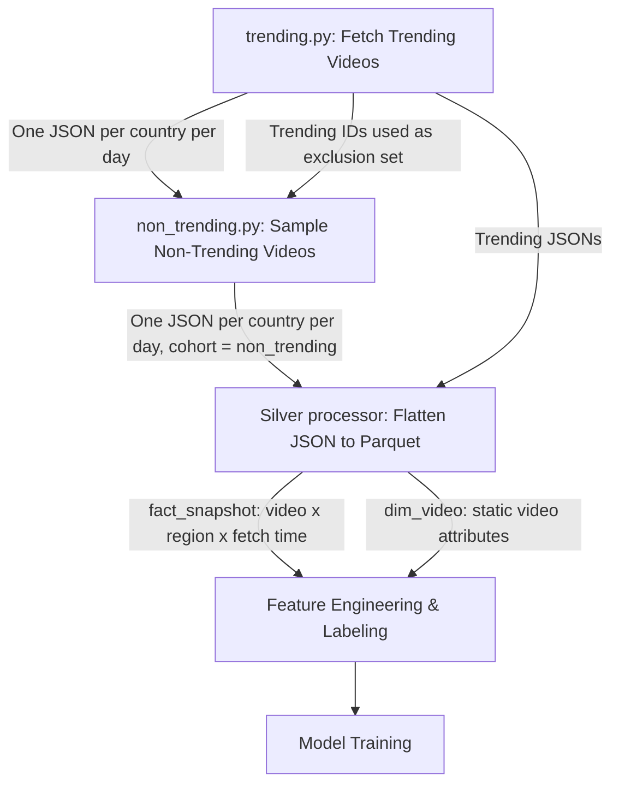

# 🚀 YouTube Trending Video Analytics and Virality Estimation 

## 🎯 YouTube Trending Video Analytics

### **Project Purpose**  
The **Tube Virality** project aims to **collect, analyze, and model YouTube trending video data** across multiple countries using the **YouTube API**. It aims to gather metrics like view counts, likes, and descriptions, then apply data science techniques to predict a video's likelihood of going viral.

### **Key Objectives**  
- ✅ **Collect Data via YouTube API**: Fetch trending videos, a control group of non-trending videos, and their statistics
- ✅ **Build Historical Database**: Track daily metrics for trending and non-trending videos across countries
- ✅ **Identify Virality Patterns**: Analyze what characteristics correlate with viral success
- ✅ **Develop Predictive Models**: Create ML models to estimate virality potential
- ✅ **Provide Actionable Insights**: Help content creators understand virality factors

---

## 🛠️ How the Data is Collected  

The data is automatically collected using the **YouTube API** and stored in this GitHub location:  
🔗 [Trending Video Metadata](https://github.com/gpsyrou/tube-virality/tree/main/assets/meta/trending)  
🔗 [Non-Trending (Control Group) Video Metadata](https://github.com/gpsyrou/tube-virality/tree/main/assets/meta/non_trending)  

### **Data Collection Process**  
1. **Fetching Trending Videos** (`trending.py`)  
   - Using the YouTube API, trending videos from multiple countries are retrieved.  
   - One JSON file per country per day is stored (e.g. `trending_videos_AR_20250322.json`), updated daily.

2. **Sampling Non-Trending Videos** (`non_trending.py`)  
   - Runs right after the trending collector, so both cohorts share the same day.  
   - For each country, it draws random short publish-time windows within the last 48 hours and collects recently published videos with `search.list`, so the controls have a similar age to trending videos.  
   - Any video that appears in the trending lists of **any** country on that day is excluded, since it is not a clean negative.  
   - Statistics and metadata (snippet, statistics, content details, status) are fetched for the remaining videos, and one JSON file per country per day is stored (e.g. `non_trending_videos_AR_20250322.json`).  
   - No label is stored at collection time. "Non-trending" only means *not trending on the sampling day*. A video may enter the trending list later, so labels are assigned downstream, after a maturity window (see [Defining Video Virality](#-defining-video-virality)).  
   - Sampling is configurable in `config.json` (`NON_TRENDING_WINDOWS_PER_COUNTRY`, `NON_TRENDING_WINDOW_MINUTES`, `NON_TRENDING_HOURS_BACK`).

3. **Daily Automation** (Automated via **GitHub Actions**)  
   - A scheduled **GitHub Actions** workflow runs `trending.py` and then `non_trending.py` every day at 11:00 UTC.  
   - Each script's output is committed to the repository in its own step, so a failure in the non-trending run never prevents the trending data from being saved.  
   - These daily snapshots provide **historical trends** for analysis.  
   - The per-video statistics update (`video_stats.py`) is currently disabled in the workflow.  
     🔗 [Video Statistics](https://github.com/gpsyrou/tube-virality/tree/main/assets/meta/video_stats)  

4. **API Quota**  
   - The YouTube Data API allows 10,000 units per day per project. With 30 countries, the daily run uses roughly 6,100 units, almost all of it from `search.list` (100 units per call) in the non-trending sampler.  
   - The remaining quota is reserved for future re-polling of video statistics.

```mermaid
graph TD;
    A[trending.py: Fetch Trending Videos] -->|One JSON per country per day| B[non_trending.py: Sample Non-Trending Videos];
    A -->|Trending IDs used as exclusion set| B;
    B -->|One JSON per country per day, cohort = non_trending| C[Silver processor: Flatten JSON to Parquet];
    A -->|Trending JSONs| C;
    C -->|fact_snapshot: video x region x fetch time| D[Feature Engineering & Labeling];
    C -->|dim_video: static video attributes| D;
    D --> E[Model Training];
```

> The earlier pipeline (`trending_db.py`, `video_stats.py`, `video_stats_db.py`) is currently disabled in the GitHub Actions workflow.

---

## 📈 Defining Video Virality  

Virality isn't simply measured by raw view count. Our analysis considers multiple factors, for example:
- A YouTuber with **1M subscribers** getting **20M views** is - potentially- expected.  
- A YouTuber with **10K subscribers** getting **2M views** is **extraordinary**.  

Our models will classify videos as **"success" (viral)** or **"non-success"**, based on the metrics retrieved, but the success/non-success will be up to us to decide.

### **Viral vs. Non-Viral Labels**

Trending is an event with a time, not a fixed property, so labels are assigned only after a maturity window of *X* days (for example 7):

- **Viral (1):** the video appears in any trending list within *X* days of publishing.  
- **Non-viral (0):** the video is older than *X* days and never appeared in a trending list.  
- **Pending:** the video is younger than *X* days. It is excluded from training until it matures.

A control video sampled on day 0 can still become trending later, so labels are always derived from the collected trending history and never from the sampling step itself.

### 🔎 **Key Virality Metrics**  

| **Metric**            | **Description**                                             | **Importance** |
|------------------------|------------------------------------------------------------|----------------|
| **Engagement Rate**     | Likes, comments, and shares relative to views             | High           |
| **Growth Velocity**     | How quickly a video gains views in the first hours/days   | Critical       |
| **Audience Reach**      | Views relative to channel subscriber count                | High           |
| **Subscriber Growth**   | New subscribers gained after video publication            | Medium         |
| **Trending Duration**   | How long a video remains on trending lists                | Medium         |

---

## 📊 Dataset & Features  

Our dataset includes key **video metadata** and **engagement statistics**, such as:  

- **Video Details**: Title, description, tags, category, language, duration, definition  
- **Engagement Metrics**: Views, likes, comments, favorite count  
- **Video Age**: Hours between publication and observation (`age_hours`)  
- **Channel Details**: Subscriber count, total videos, upload frequency  
- **Trending History**: How long a video remains on the trending list, and its rank  
- **Cohort**: Whether a video comes from the trending list or the non-trending control sample  
- **Country-Based Analysis**: Virality trends across different regions  

### **Data Layers**

Raw JSON files from the API are kept unchanged and processed into normalized Parquet tables:

| **Table**        | **Grain**                        | **Content**                                                                 |
|------------------|----------------------------------|-----------------------------------------------------------------------------|
| `fact_snapshot`  | video x region x fetch time      | Rank, views, likes, comments, `age_hours`, cohort (partitioned by date)     |
| `dim_video`      | one row per video                | Channel, publish time, title, description, category, language, tags         |

- Counts are stored as nullable integers, because hidden likes or disabled comments are missing values, not zeros.  
- Early files have no fetch timestamp, so the date in the filename is used and the rows are flagged (`fetched_at_inferred`). `age_hours` is approximate for them.  
- Videos appearing in several countries are stored once in `dim_video`, with one `fact_snapshot` row per country and fetch.

📌 **Goal:** Use these features to identify patterns and train models for virality prediction.  

---

## 🔬 Methodology  

1️⃣ **Data Collection** – Retrieve daily trending videos and a control sample of non-trending videos across countries.  
2️⃣ **Data Cleaning & Preprocessing** – Flatten raw JSON into normalized tables, handle missing values, outliers, and standardize data.  
3️⃣ **Exploratory Analysis** – Identify key trends and patterns, including cross-country overlap.  
4️⃣ **Feature Engineering** – Extract additional insights like growth rate and engagement score, using only information available at prediction time to avoid leakage.  
5️⃣ **Labeling** – Assign viral / non-viral labels after the maturity window.  
6️⃣ **Model Development** – Train ML models for virality prediction.  
7️⃣ **Evaluation & Interpretation** – Validate predictions and refine models. Because the control sample is not the real-world distribution, metrics such as ROC-AUC and PR-AUC are reported together with the base rate.  

---

## 🔨  Technologies Utilized  

We've harnessed a blend of cutting-edge technologies to power the **Tube Virality** project:  
🔹 **Python 3.10** – Data collection, processing, analysis, and ML model training. (currently) 
🔹 **Pandas & Parquet** – Normalized storage of snapshots and video attributes. (currently) 
🔹 **SQL** – Storing structured video metadata for analysis. (future iteration)
